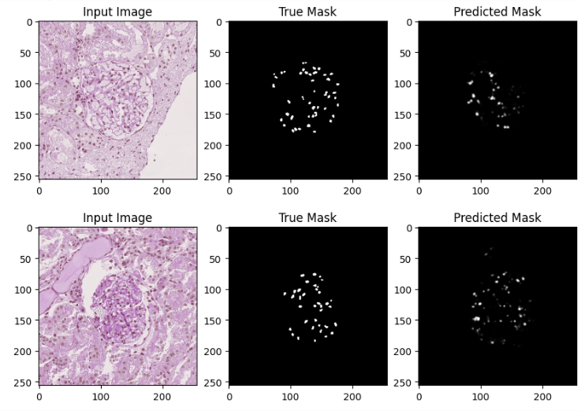

# PAS based U-Net

I trained a PAS-based Attention U-Net model on PAS-stained glomeruli images, using manually annotated masks to identify podocytes. The goal was to develop a model that could directly predict the presence of podocytes from PAS-stained images. Given that PAS staining does not naturally highlight podocytes, this task was particularly challenging.

The model's performance, as indicated by the results, was suboptimal. The key metrics—such as F1 score, precision, recall, and IoU—were notably low, with values of 0.290, 0.398, 0.229, and 0.170, respectively. These results suggest that the model struggled significantly to accurately detect podocytes in the PAS-stained images. Although the overall accuracy was 0.988, the other performance metrics indicate that the model was not effective in making reliable predictions.

## Results

Figure 1: PAS based U-Net output. The first figure on the left is input, the middle image is the manually annotated ground truth, and the image on the right is the model output without any further image processing.
